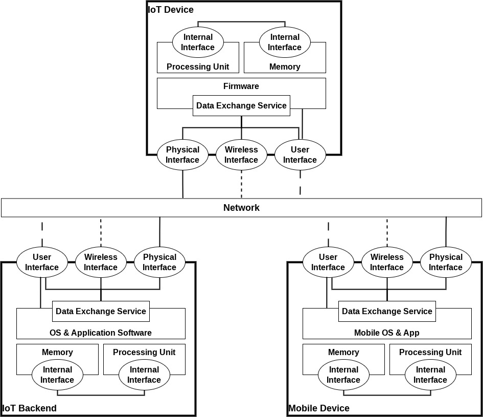

# 2.1. IoT Device Model

The device model presented in this chapter is based on the device model introduced by the OWASP ISTG. We refined the ISTG device model to clarify some ambiguities of the original device model and to extend it to also include parts of the IoT ecosystem excluded by the original model like backend systems usually running on cloud infrastructure and app running on mobile devices.

ToDo: Currently our device model assumes that IoT devices are directly connected over an interconnection network to backend systems and mobile devices. IoT devices that require hubs to translate between different network protocols are currently not included in the device model.

## Device Boundaries

In order to distinguish between components belonging to an IoT device and components of the surrounding IoT ecosystem, it is necessary to first define the boundaries of an IoT device. An IoT device is generally encompassed by an enclosure of some kind, which (physically) separates device-internal elements from device-external elements.

Interactions between internal and external elements are only possible via interfaces. Within this guide, these interfaces are not considered to be part of the enclosure. Instead, those interfaces will be categorized individually (see [Interfaces](#interfaces)).

As will be explained in one of the next sections, the term "component" refers to an item that can be the subject of a penetration test. Thus, device-internal elements and interfaces are considered components within this guide.

## IoT Ecosystem

Our device model tries to incorporate a more detailed view of the IoT ecosystem (in contrast to the original OWASP ISTG device model that only focuses on the IoT device itself). We mostly focus on consumer IoT devices where the IoT ecosystem consists of backend systems, usually deployed on cloud infrastructures, and apps running on mobile devices. The original OWASP ISTG device model is generic enough so that the same components that make up an IoT device can also be used to sufficiently describe IoT backend systems and mobile devices running IoT apps. Therefore we can generally use the same test cases designed for the specific component. Also the same device boundaries apply. An enclosure usually encloses the internal components of backend systems and mobile devices and interactions between internal and external elements are only possible via interfaces.

Physical and wireless interfaces are connected to interconnection networks that allow to establish direct connections between IoT devices, backend systems and apps and enable data exchange among them.

Test cases are usually run on the server-side of a data connection. For example, when analysing the data connection between an IoT device (which has the role of a client) and a backend system (which has the role of a server) then the test cases are run in the context of the data exchange services on the backend service side.

## Components

As introduced in the previous sections, the proposed device model should provide a generalized selection of parts that IoT devices, backend systems and mobile devices running apps consist of. These parts will be referred to as components. Every component is a piece of soft- and/or hardware that, in theory, can be tested individually. The penetration test scope for an IoT device, backend system or app running on an mobile devices can therefore be defined as a list of components.

### Device-Internal Elements

Every device-internal element is a component residing inside the device enclosure. Thus, they are part of the IoT device. IoT devices usually comprise the following internal elements, all of which are mentioned in the list of attack surfaces composed by OWASP ([source][owasp_iot_attack_surface_areas]):

- **Processing unit:** The processing unit, also called processor, is responsible for managing and performing data processing tasks. These tasks are defined as a sequence of instructions that are loaded from the memory. A device has at least a central processing unit handling its core functionalities (defined by the firmware). However, more complex devices might also be equipped with further processing units that are assigned to specific subtasks. A special kind of processor are microprocessors, built on a single circuit. Microcontrollers are microprocessors, which also have analog and digital in- and outputs. They are typically used to control the behavior of a device and are often used in the embedded field. ([source][ekomp_processor])

  *Examples: x86 processor, ARM processor, AVR processor*

- **Memory:** Memory is used to store data, such as programs (instructions for a processing unit) and information, in binary form. Depending on the type of memory, it is used to temporarily store data while being processed by a processing unit (primary memory or cache) or to permanently store data on a device even while the device is turned off (secondary memory). A special kind of secondary memory is flash memory. It is commonly used in many devices because it is energy-saving, develops less heat and is less susceptible to vibration and magnetic fields due to the lack of moving parts. Flash memory is based on semiconductor technology and able to provide fast and permanent access to data (read, write, delete). ([source][ekomp_flash_memory], [source][ekomp_memory])

  *Examples: EEPROM, flash memory*

- **Firmware:** "Firmware is a software program or set of instructions programmed on a hardware device" ([source][tech_terms_firmware]). It is used to control the device and the communication between device-internal and -external elements (data in- and output via data exchange services). Firmware is stored on a memory and executed by a processing unit. In case of IoT backend systems the term *firmware* mostly refers to the server-side software the backend system is comprised of, and in case of mobile systems it mostly refers to the apps that are part of the IoT ecosystems. In regards of device firmware, the following components might be potential targets for a penetration test:

  -   **Installed firmware:** Installed firmware refers to firmware that is already installed on a device. It might be the target of dynamic analyses and usually handles the storage and processing of sensitive user data.

  -   **Firmware update mechanism:** A firmware update mechanism is part of the firmware and defines how firmware updates, in the form of firmware packages, can be installed on a device. A crucial responsibility of a firmware update process is to ensure that only proper firmware packages can be installed and executed.[^1]

  *Examples: OS, RTOS, bare-metal embedded firmware*

- **Data exchange service:** Data exchange services refer to programs or parts of programs, used to transfer data between two or more components via an interface (e.g., network, bus). These services are part of the firmware and can be used to transmit data, receive data or both.

  *Examples: network service, debug service, bus listener*

[^1]: For performing a test of a firmware update mechanism, a firmware package is required. Due to the fact that a firmware package could also be inspected separately, it could be considered a component as well. However, since this guide focuses on device-internal elements and device interfaces only, firmware packages are not in scope. Contrary to installed firmware, an update package also includes the firmware header, which might include important data.

### Interfaces

Interfaces are required to connect two or more components with each other. Interactions between device-internal elements or between device-internal and device-external elements are only possible via interfaces. Based on which components are connected by an interface, it can be categorized as a machine-to-machine or human-to-machine interface. As long as at least one of the connected components is a device-internal element, the interface itself is also part of the device.

Data exchange services (that often use interfaces for communication) and interfaces have a huge overlap when it comes to test cases. To aid in test case selection we further distinguish on what layers of the ISO/OSI reference model interfaces and data exchange services are located. The purpose of interfaces is to establish connections and enable communication and therefore they are placed on the transport (lower) layers of the ISO/OSI reference model. The purpose of data exchange services is to exchange application data and implement application protocols and therefore they are placed on the application (upper) layers of the ISO/OSI reference model. Test cases should be selected as appropriate for the specific layers.

Within this guide, the following kinds of interfaces will be differentiated, all of which are either directly or indirectly mentioned in the list of attack surfaces, composed by OWASP ([source][owasp_iot_attack_surface_areas]):

- **Internal interfaces (machine-to-machine):** These interfaces are used to establish a connection between device-internal elements and are usually not accessible from outside the device enclosure. However, in some cases internal interfaces may be accessible from the outside in an non-invasive way (e.g. UART interface on the Dreame L10 Pro vacuum robot). Therefore, our defining characteristic of internal interfaces in such cases is that internal interfaces are usually not meant to be accessible (according to the design and specification) from the outside. We still regard them as internal interfaces to avoid duplicating test cases.

  *Examples: JTAG, UART, SPI*

- **Physical interfaces (machine-to-machine):** Physical interfaces  are used to establish a connection between device-internal and -external elements, based on a physical connection between the components or the respective interfaces of those components. Therefore, physical interfaces require a socket or a port, built into the device enclosure and thus are accessible from outside the device.

  *Examples: USB, Ethernet*

- **Wireless interfaces (machine-to-machine):** Similar to physical interfaces, wireless interfaces are also used to establish a connection between device-internal and -external elements. However, the connection between wireless interfaces is not based on a physical connection, but on radio waves, optical signals or other wireless technologies. Wireless interfaces are accessible from outside the device, usually from a greater distance than physical interfaces.

  *Examples: Wi-Fi, Bluetooth, BLE, ZigBee*

- **User interfaces (human-to-machine):** In contrast to all other above-mentioned interfaces, user interfaces are not utilized to establish a connection between two machines. Instead, their purpose is to allow interactions between device-internal elements and a user. These interactions can either be based on a physical connection, e.g., in case of a touch display, or wireless connections, e.g., in case of a camera or microphone. In case of local web applications a user interface requires an underlying physical or wireless interface for communication. In such cases we again use the ISO/OSI reference model to select appropriate test cases. Physical or wireless interfaces are located on the transport (lower) layers and user interfaces are located on the application (upper) layers of the ISO/OSI reference model. User interfaces may also use data exchange services in the background to implement their functionality. In such cases the test cases already being run in the context of the data exchange services do not need to be repeated for the user interfaces. The test cases for the user interface should instead concentrate on aspects not covered by data exchange services (mainly human-technology interaction related aspects).

  *Examples: touch display, camera, microphone, local web application (hosted on the device)*

## Device Model Scheme

The device model is a combination of all above-mentioned components and can be seen in the figure below. It must be noted that, even though cardinalities were not included for better readability, more than one instance of each component might be built into an IoT device. 

Other models, e.g., the ones mentioned in [Related Work](#related-work), include sensors and actors as components of a device. Within this guide, sensors and actors are considered physical, wireless or user interfaces respectively because they enable interactions between device-internal and -external elements or users via physical (e.g., touch sensor, door control) or wireless connections (e.g., microphone, temperature sensor).

In some cases, it is also possible that devices comprise parts which can be considered devices themselves (i.e., nested devices). It then depends on the perspective of the observer which interfaces are classified as internal and external. The determining factor are the boundaries between the observer and the interface (see [Device Boundaries](#device-boundaries), [Device-Internal Elements](#device-internal-elements) and [Interfaces](#interfaces)).

While the original ISTG uses an abstract representation of IoT devices without considering mobile devices and IoT backends, we explicitly represent them within the device model. Contrary to the OWASP ISTG model, which only focuses on the device and the components it is built of, our model also includes the device's ecosystem, namely mobile devices and the IoT backend.

[reference_architecture]: https://ieeexplore.ieee.org/document/7872918	"Comparison of IoT platform architectures: A field study based on a reference architecture"
[owasp_iot_attack_surface_areas]: https://wiki.owasp.org/index.php/OWASP_Internet_of_Things_Project#tab=IoT_Attack_Surface_Areas	"OWASP IoT Attack Surface Areas Project"
[tech_terms_firmware]: https://techterms.com/definition/firmware	"TechTerms.com"
[ekomp_processor]: https://www.elektronik-kompendium.de/sites/com/0309161.htm	"CPU - Central Processing Unit / Hauptprozessor"
[ekomp_flash_memory]: https://www.elektronik-kompendium.de/sites/com/0312261.htm	"Flash-Speicher / Flash-Memory"
[ekomp_memory]: https://www.elektronik-kompendium.de/sites/com/1812051.htm	"Speicherarchitektur"
