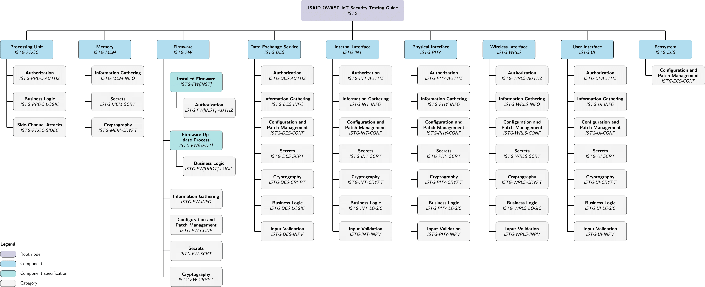

# JSAID OWASP IoT Security Testing Guide

The JSAID OWASP IoT Security Testing Guide is a modified version of the original OWASP IoT Security Testing Guide.

ToDo: More Detailed Description

## JSAID
The Josef Ressel Centre for Security Analysis of IoT Devices (JSAID) is a research center supported by the Christian Doppler Forschungsgesellschaft. JSAID focuses on the security analysis of Consumer IoT (CIoT) devices, which are physical objects connected to a network, such as routers, smartphones, fridges, door locks, and toys. With the proliferation of IoT devices, ensuring their security has become crucial, especially in smart homes where personal data privacy is at risk.

JSAID aims to systematically and reliably evaluate the security of various IoT devices, primarily those used in consumer IoT and smart city sectors. The focus lies on assessing devices' security against both cyber and physical attacks, as well as the security of data transmission. The ultimate goal is to establish an independent certification process for IoT devices, enabling consumers to make informed choices about their purchases.

The consortium behind JSAID comprises three partners: MCI (University of Applied Sciences, Innsbruck, Austria), IKB (Municipal Infrastructure Services Company, Innsbruck, Austria), and AV-Comparatives GmbH (Antivirus Software Testing Company, Innsbruck, Austria). Together, their aim is to work towards enhancing the security standards of IoT devices to safeguard user privacy and data integrity.

## OWASP IoT Security Testing Guide

The OWASP IoT Security Testing Guide provides a comprehensive methodology for penetration tests in the IoT field offering flexibility to adapt innovations and developments on the IoT market while still ensuring comparability of test results. The guide provides an understanding of communication between manufacturers and operators of IoT devices as well as penetration testing teams that’s facilitated by establishing a common terminology.

Security assurance and test coverage can be demonstrated with the overview of IoT components and test case categories applicable to each below. The methodology, underlying models, and catalog of test cases present tools that can be used separately and in conjunction with each other.

- 🔔[Click here to read the original OWASP ISTG 📖📚]( https://owasp.org/owasp-istg/)🔔

## Changes compared to the original OWASP ISTG

- We introduce the [certification process](./src/02_framework/analysis_process.md) as a guidline for penetration testers
  - Prior, only a list of tests was provided by ISTG.
  - We guide testers through the process and assessment of the tests.
- Extended [Device Model Scheme](./src/02_framework/device_model.md#device-model-scheme)
  - ISTG did not consider (Cloud) backend or mobile devices that run applications to use and control the IoT device.
  - For us, the firmware and data exchange service is closely tied to the physical, wireless, and user interface of the IoT device, as opposed to the original ISTG.
  - This is also pictured in the [analysis process](./src/02_framework/analysis_process.md#1st-step-create-profiles-for-iot-device).
- We require a device profile that systematically structures the main components of the device and defines subsequent tests.
  - As an example, depending on the processing unit and the operating system, different tests have to be conducted if there is embedded Linux running on an IoT device or just a microcontroller running a binary blob of code.
  - This is mapped into the second step of the [analysis process](./src/02_framework/analysis_process.md#2nd-step-create-profiles-for-relevant-backend-systems-and-mobile-apps).
- We introduce additional [security categories](./src/02_framework/attacker_model.md#security-levels), each with four different levels, considering
  - Data Security (DS): Non-Critical Data (DS-1), Sensitive Data (DS-2), Privacy Related Data (DS-3), Confidential Data (DS-4)
  - Security Impact (SI): Insignificant Impact (SI-1), Minor Impact (SI-2), Major Impact (SI-3), Critical Impact (SI-4)
- Within the [Testing Methodology](./src/02_framework/methodology.md) we
    - introduce [Verification Levels](./src/02_framework/methodology.md#verification-levels) to specify the effort required to run a specific test case and to what extend the subject of investigation will be analyzed verification levels are used: Formal verification (VL-1), Method verification (VL-2), Implementation verification (VL-3), Overall verification (VL-4).
    - extend the [Structure of Test Cases](./src/02_framework/methodology.md/#structure-of-test-cases)
        - Requirments: (previously comprised required physical and authentication access levels) Now, includes (besides physical and authentication access level) the data security level, security impact level, verification level, and the firmware type - mapped into the [analysis process](./src/02_framework/analysis_process.md#3rd-step-specify-scope-of-analysis-and-identify-relevant-test-cases).
        - Step-By-Step Execution: detailed list of steps that should be done to execute the test case - mapped into the [analysis process](./src/02_framework/analysis_process.md#4th-step-run-test-cases).
        - Assessment: how the results of the test case should be interpreted - mapped into the [analysis process](./src/02_framework/analysis_process.md#5th-step-assess-test-case-results).
- Example analyses of specific IoT devices (work in progress)
  - [Shelly Duo RGBW GU10](./examples/Shelly_Duo_RGBW_GU10.md)
  - [TP-Link Tapo C100](./examples/TP-Link_Tapo_C100_WiFi-Camera.md)

## Table of Contents

1. [**Introduction**](./01_introduction/README.md)

2. [**IoT Security Testing Framework**](./02_framework/README.md)

   2.1. [IoT Device Model](./02_framework/device_model.md)

   2.2. [Attacker Model](./02_framework/attacker_model.md)

   2.3. [Testing Methodology](./02_framework/methodology.md)

   2.4. [Analysis Process](./02_framework/analysis_process.md)

3. [**Test Case Catalog**](./03_test_cases/README.md)

   3.1. [Processing Units (ISTG-PROC)](./03_test_cases/processing_units/README.md)

   3.2. [Memory (ISTG-MEM)](./03_test_cases/memory/README.md)

   3.3. [Firmware (ISTG-FW)](./03_test_cases/firmware/README.md)

      3.3.1. [Installed Firmware (ISTG-FW[INST])](./03_test_cases/firmware/installed_firmware.md)

      3.3.1. [Firmware Update Mechnanism (ISTG-FW[UPDT])](./03_test_cases/firmware/firmware_update_mechanism.md)

   3.4. [Data Exchange Services (ISTG-DES)](./03_test_cases/data_exchange_services/README.md)

   3.5. [Internal Interfaces (ISTG-INT)](./03_test_cases/internal_interfaces/README.md)

   3.6. [Physical Interfaces (ISTG-PHY)](./03_test_cases/physical_interfaces/README.md)

   3.7. [Wireless Interfaces (ISTG-WRLS)](./03_test_cases/wireless_interfaces/README.md)

   3.8. [User Interfaces (ISTG-UI)](./03_test_cases/user_interfaces/README.md)

   3.9. [Ecosystem (ISTG-ECS)](./03_test_cases/ecosystem/README.md)

## Related Work

The concepts, models and test steps presented in the OWASP IoT Security Testing Guide are based on the master's thesis **"Development of a Methodology for Penetration Tests of Devices in the Field of the Internet of Things"** by Luca Pascal Rotsch.

Test cases were derived from the following public sources:

* OWASP [**"Web Security Testing Guide"**][owasp_wstg]
* OWASP [**"Firmware Security Testing Methodology"**][owasp_fstm]
* OWASP [**"Mobile Security Testing Guide"**][owasp_mstg]
* [**"IoT Pentesting Guide"**][iot_pentesting_guide] by Aditya Gupta
* [**"IoT Penetration Testing Cookbook"**][iot_penetration_testing_cookbook] by Aaron Guzman and Aditya Gupta
* [**"The IoT Hacker's Handbook"**][iot_hackers_handbook] by Aditya Gupta
* [**"Practical IoT Hacking"**][practical_iot_hacking] by Fotios Chantzis, Ioannis Stais, Paulino Calderon, Evangelos Deirmentzoglou, and Beau Woods
* further sources are referenced in the respective test cases

**We also like to thank our collaborators and supporters (see [Project Collaborators and Acknowledgements](./acknowledgements.md))!**

[cc-by-sa]:  http://creativecommons.org/licenses/by-sa/4.0/
[cc-by-sa-shield]: https://img.shields.io/badge/License-CC%20BY--SA%204.0-lightgrey.svg
[owasp_wstg]: https://owasp.org/www-project-web-security-testing-guide/	"OWASP Web Security Testing Guide"
[owasp_fstm]: https://github.com/scriptingxss/owasp-fstm	"OWASP Firmware Security Testing Methodology"
[owasp_mstg]: https://owasp.org/www-project-mobile-security-testing-guide/	"OWASP Mobile Security Testing Guide"
[iot_pentesting_guide]: https://www.iotpentestingguide.com	"IoT Pentesting Guide"
[iot_penetration_testing_cookbook]: https://www.packtpub.com/product/iot-penetration-testing-cookbook/9781787280571	"IoT Penetration Testing Cookbook"
[iot_hackers_handbook]: https://link.springer.com/book/10.1007/978-1-4842-4300-8	"The IoT Hacker's Handbook"
[practical_iot_hacking]: https://nostarch.com/practical-iot-hacking	"Practical IoT Hacking"
